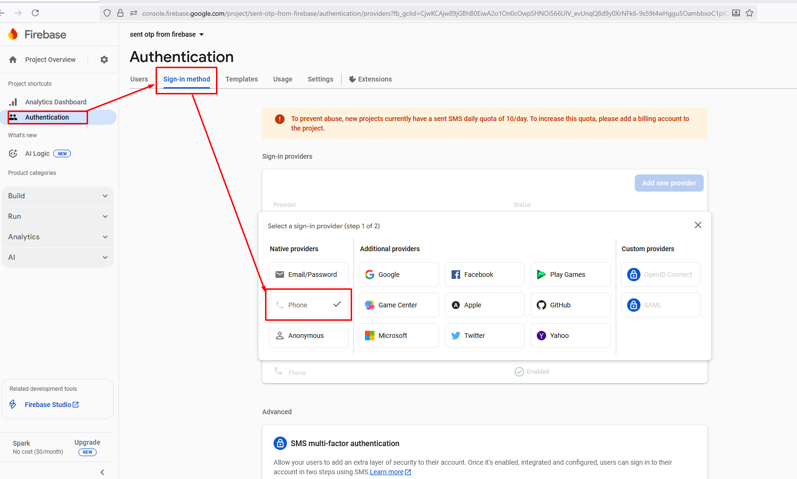
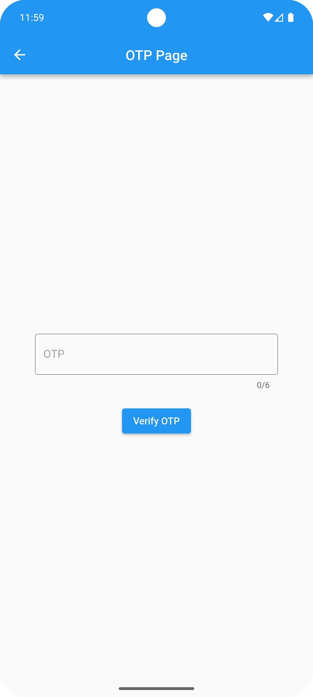
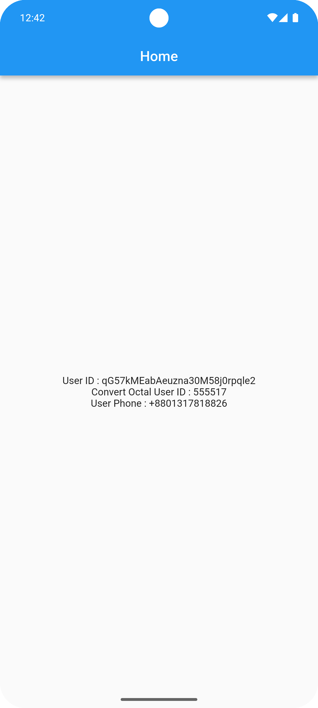

# 🚀 Push OTP From Firebase

A **Flutter-based application** to securely **send OTPs using Firebase Authentication**.  
This project also includes a **helper function** to generate **6/8-digit octal UID codes**, making it ideal for user identification and secure verification flows.

---

## 🌟 Features

- 🔹 Send OTP directly using Firebase Authentication.
- 🔹 Generate **6 or 8-digit octal UID codes** for unique identification.
- 🔹 Supports **Android** and **iOS** platforms.
- 🔹 Simple, responsive, and user-friendly OTP input UI.
- 🔹 Clean and modular Flutter project structure for easy integration.

---

## 🛠️ Helper Function

The project provides a **helper function** to generate a UID in **octal format**:

```dart
final helper = OctalHelper(secretKey: "aspProthesShreyasi");
final octal8 = helper.generateOctalCode(uid: userId, length: 6);
```
##🏁 Getting Started
- 🔹Flutter SDK installed ✅
- 🔹Firebase project configured ✅
- 🔹Android/iOS simulator or real device ✅

## Installation
- Clone the repository
```bash
git clone https://github.com/prothesbarai/push_otp_from_firebase.git
```

## 📸 Screenshots
<p align="center">     </p>